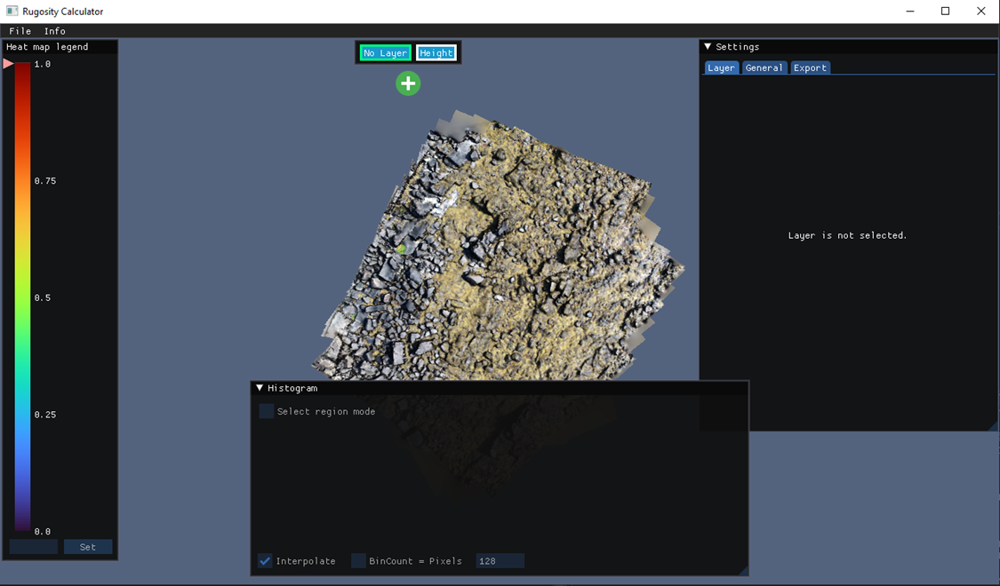
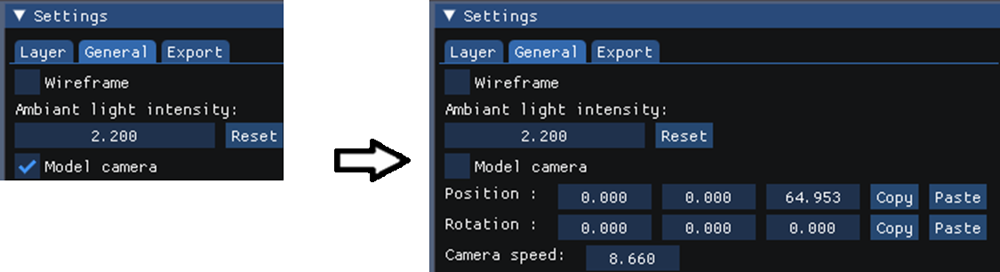
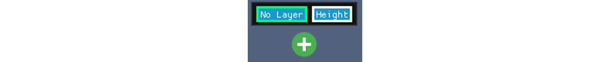
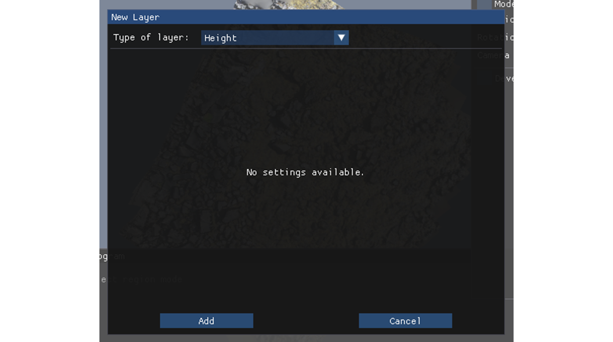
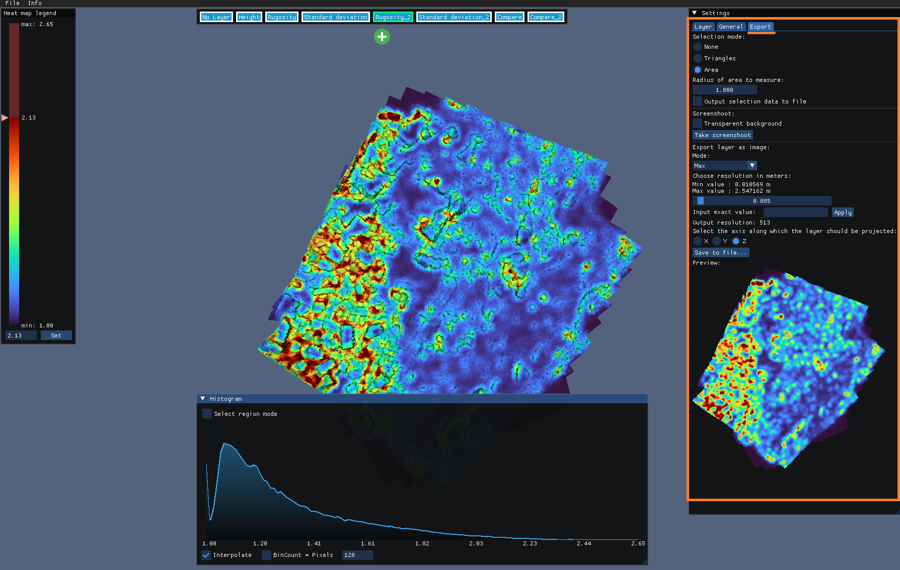

## General Information

Before you can start working with our application, you will need to have a 3D model of your object of interest, be it coral, a dive site, or another subject. 3D models can be created from a collection of photos or videos using a program like [Reality Capture](https://www.capturingreality.com/realitycapture).

## Load Your Model

Our application currently only supports the `.OBJ` and `.RUG` file format for 3D models. There are two ways to load your model:

- Drag and drop your file onto the application window.
- Use the main menu: File -> Load…

After the file is loaded, your model will appear in the center of the window(Figure 1).

Figure 1: Application after model was loaded.

## Examining the Model

You can rotate the model by pressing and holding the right mouse button. If you require more camera movement freedom to examine specific details of the model from various angles, you'll need to disable the "Model Camera" mode. You can do this by unchecking the "Model Camera" box found in the "General" tab of the Settings window(Figure 2).

Figure 2: Enabling more flexible camera.

Once you have disabled the "Model Camera" mode, you can move the camera freely. Press and hold the right mouse button, then use the `W`, `A`, `S`, `D` keys in conjunction with mouse movement to navigate.

## Creating and Using Layers
 
Our application utilizes layers to represent various types of information, such as complexity metrics. Once a model is loaded, you can find the layer tabs at the top middle of the application window:

Figure 3: Layer tabs.

The first two tabs, "No Layer" and "Height", have straightforward functions. "No Layer" displays the raw model with a solid color, or RGB colors if the model includes these. "Height" stores information about the relative heights of parts of the model.

To perform rugosity or other calculations, you will need to add a new layer. To do this, press the green circle with the white cross symbol (refer to Figure 3). A new window will appear, in which you should select the type of new layer to add (see Figure 4).

Figure 4: New layer window.

After selection you can tweak settings available for that layer type.

## Save your work

Users can save entire workspace using a custom `.RUG` format. To do that:
- Use the main menu: File -> Save…

`.RUG` files save all layers alongside the model, decreasing model load times and eliminating the need to re-run calculations.

## Export

- Selection tool: The user can query the layer value of a single triangle or the layer values within a specified radius of a point. If the 'Export to File' option is activated, then the values will be automatically saved to a text file.
- Screenshot: The 'Take Screenshot' button generates a screenshot without the GUI and with a larger legend, making it suitable for use in figures.
- Whole Layer as Image: Layer values will be projected onto a plane and converted to a `PNG` or `GeoTIFF` (color or `32-bit float` with raw values) image. The `32-bit float` raw export is essential for easy use of the application's calculation results in other applications.
	- Cumulative Suboption: In complex 3D models, multiple triangles may project to the same pixel when creating a 2D image. The cumulative option resolves this by accumulating the complexity metric along the projection axis, creating an "X-ray" effect that preserves information about high-complexity areas. This option is useful for models with overhangs and caves.

Figure 5: Export options are located in the Export tab.

