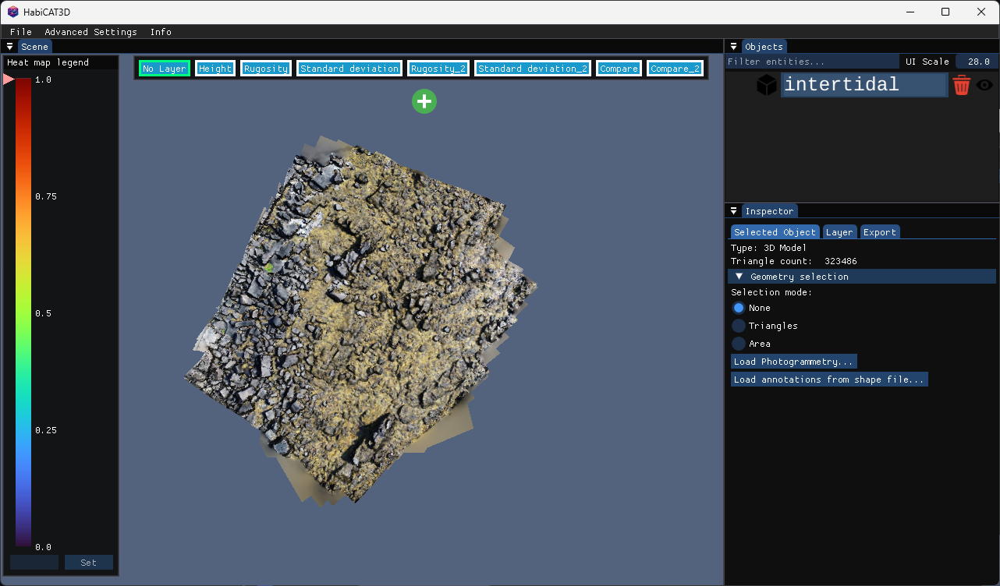
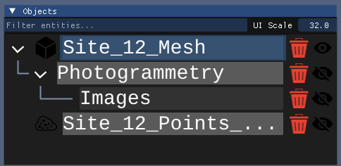
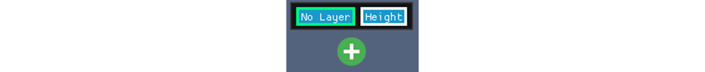
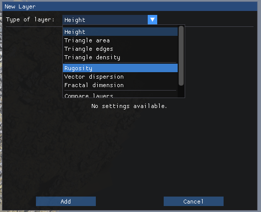
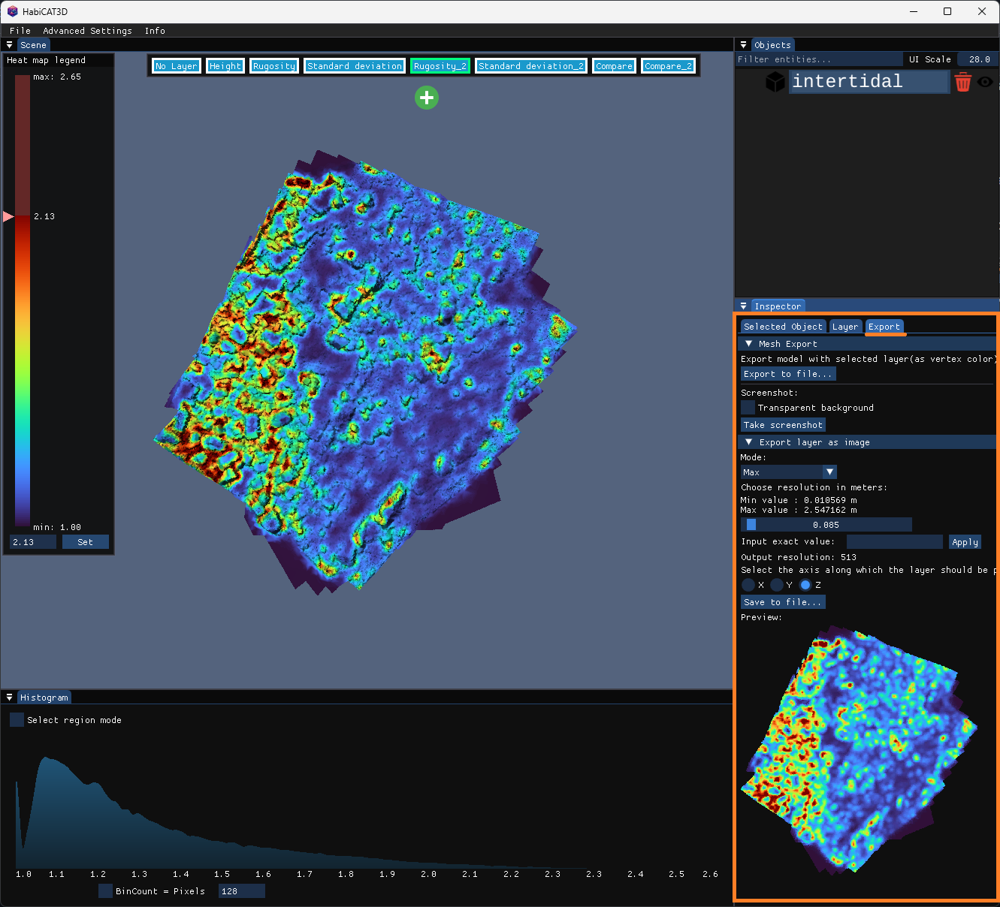

## General Information

Before you can start working with our application, you will need a 3D model or a point cloud of your object of interest, be it coral, a dive site, or another subject. 3D models and point clouds can be created from a collection of photos or videos using a program like [Reality Capture](https://www.capturingreality.com/realitycapture). Point clouds from other sources, such as lidar, can be loaded as well.

## Load Your Model

Our application supports the following file formats:

- 3D models: `.OBJ` and `.PLY`
- Point clouds: `.PLY`, `.LAS` and `.LAZ`
- Workspaces saved by the application: `.RUG` (see "Save your work" below)

There are two ways to load a file:

- Drag and drop your file onto the application window.
- Use the main menu: File -> Load…

After the file is loaded, your model will appear in the center of the window(Figure 1).

Loading another file adds it to the project next to the objects that are already loaded. To start from scratch, use the main menu: File -> Close all.

Figure 1: Application after model was loaded.

## Working with Multiple Objects

All loaded objects are listed in the "Objects" window (Figure 2). Each entry has an icon showing whether it is a 3D model or a point cloud. Additional data loaded for an object, such as photogrammetry images or annotations, appears nested under it.

Figure 2: Objects window with several loaded objects.

Only one object is active at a time. Click an object in the list to make it active. Layers, the histogram and the Inspector window always refer to the active object, and each object keeps its own set of layers. Double-click an object to focus the camera on it.

Each entry has two buttons:

- Eye icon: shows or hides the object.
- Trash bin icon: removes the object from the project.

## Examining the Model

The camera orbits around the model:

- Press and hold the left mouse button and move the mouse to rotate the model.
- Press and hold the right mouse button and move the mouse to pan.
- Use the mouse wheel to zoom in and out.

## Creating and Using Layers
 
Our application utilizes layers to represent various types of information, such as complexity metrics. Each object has its own set of layers. Once an object is loaded, you can find the layer tabs of the active object at the top middle of the application window:

Figure 3: Layer tabs.

The "No Layer" tab displays the raw model with a solid color, or RGB colors if the model includes these. For 3D models, a "Height" layer is created automatically. It stores information about the relative heights of parts of the model. Point clouds start with the "No Layer" tab only.

To perform rugosity or other calculations, you will need to add a new layer. To do this, press the green circle with the white cross symbol below the layer tabs (refer to Figure 3). A new window will appear, in which you should select the type of new layer to add (see Figure 4). The available types depend on the type of the active object:

- 3D models: Height, Triangle area, Triangle edges, Triangle density, Rugosity, Vector dispersion, Fractal dimension, Compare layers.
- Point clouds: Point density, Fractal dimension, Structural roughness.

Figure 4: New layer window.

After selection you can tweak settings available for that layer type. Press "Add" to calculate the new layer.

## Save your work

Users can save entire workspace using a custom `.RUG` format. To do that:
- Use the main menu: File -> Save…

`.RUG` files save all loaded objects together with their layers, decreasing load times and eliminating the need to re-run calculations.

## Export

Export options are located in the "Export" tab of the Inspector window (Figure 5).

- Mesh Export: A 3D model can be exported as an `.OBJ` file with the values of the active layer stored as vertex colors.
- Screenshot: The "Take screenshot" button generates a screenshot without the GUI and with a larger legend, making it suitable for use in figures. Tick "Transparent background" to get a screenshot with a transparent background.
- Export layer as image (3D models only): Layer values will be projected onto a plane and converted to a `PNG` or `GeoTIFF` (color or `32-bit float` with raw values) image. The `32-bit float` raw export is essential for easy use of the application's calculation results in other applications. Press "Activate preview" to see the result and "Save to file..." to save it.
	- Cumulative Suboption: In complex 3D models, multiple triangles may project to the same pixel when creating a 2D image. The cumulative option resolves this by accumulating the complexity metric along the projection axis, creating an "X-ray" effect that preserves information about high-complexity areas. This option is useful for models with overhangs and caves.

Figure 5: Export options are located in the Export tab of the Inspector window.

The selection tool is located in the "Selected Object" tab of the Inspector window under "Geometry selection". With it, the user can query the layer values of a single triangle or the average layer values within a specified radius of a point.